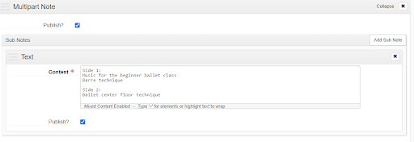

# AMI Description in ArchivesSpace
{: .no_toc }

This section covers how to describe AMI recordings in ArchivesSpace. AMI components should never be manually created in ASpace. AMI data should be exported from SPEC, desribed in a spreadsheet, and then imported into ASpace. This ensures that AMI identifiers exactly match between SPEC and ASpace, and that metadata in the finding aid is populated in the correct fields. This section only covers tasks specific to ASpace. For information about descriptive practices, see the sections of the Archival Processing Manual on [Processing Audio and Moving Image Material](https://nypl.github.io/archival-processing/processing-manual/processing-ami/) and [Description of Electronic Records in ArchivesSpace](https://nypl.github.io/archival-processing/processing-manual/archival-description/description-of-ers-in-aspace/).

## Table of Contents
{: .no_toc .text-delta }

- TOC
{:toc}

# Working With AMI Imported into ASpace
After your SPEC AMI inventory is imported into ASpace, you will see a new series-level component titled _AMI Series_. This component will always contain three child-components: Audio, Video, and Film, which is illustrated below.

Remember that these are just place-holder names, which are almost never kept in your final description.

Each format type will contain child components corresponding to the _group_ names you assigned in your inventory. 

If you did not assign group names, then components will just appear in the order you created them. 

If you used the _sequence_ field in your inventory, these numbers will be appended to the title in brackets. 

# AMI Extents
Each AMI component should include an extent statement of _1 audio recording_ or _1 moving image recording_. See the section of the processing manual on [AMI extents](/archival-processing/processing-manual/description-of-ami-in-aspace.md#ami-component-extent-statements). AMI extents are automatically added to each component when the AMI inventory is imported into ASpace.

# Arranging AMI Components in ASpace
This section addresses some common post-import descriptive tasks to perform in ASpace. For detailed information on how to arrange and describe audio and moving image content in finding aids see the [Processing Audio and Moving Image Material](https://nypl.github.io/archival-processing/processing-manual/processing-ami/) and [Description of Electronic Records in ArchivesSpace](https://nypl.github.io/archival-processing/processing-manual/archival-description/description-of-ers-in-aspace/) sections of the Archival Processing Manual.

## Splitting Non-Consecutive Dates
If an AMI item has multiple dates associated with it in the inventory, all dates will be imported into a single Date field. You will need to manually move non-consecutive dates into their own dates subfield as illustrated below.

## Publishing Notes
Notes imported into ASpace via the inventory spreadsheet are often unpublished by default. This means the notes will not appear in the PDF export of the finding aid, and will be "internal" notes in the EAD. Once you have completed your import, make sure to select the Publish All button from the top-level of the Resource record, as illustrated below. 

## Working with Unavailable Material
AMI is often not digitized before the inventory is added to the finding aid. There is still much that can be done to describe what you do know about the media since you will have gained a strong level of knowledge and experience with the collection through processing. 

It is okay for metadata to contain some redundancies until the content can be verified. Any arrangement and description work you do at this stage, will aid in future work that will very likely be done by a different archivist. 

When working on arrangement, focus on tasks such as grouping together interviews made for a single project, or identifying recordings from a single production and listing them together. 

In description, try to write out acronyms when they are known, and fix inconsistencies in titles. You should also use this time to format tracklists into ordered lists. See the instructions below for how to create ordered lists in ASpace.

## Suppressing AMI Components
The Dance division suppresses AMI content until it is digitized. Suppression allows for managing descriptive components within a finding aid without publishing them for public view. Remember that components cannot be edited or moved in ASpace until they are unsuppressed.

To suppress an AMI component click on the _Suppress_ button on the top right of the Archival Object screen in ArchivesSpace.

When you suppress a component in ASpace the component will not be published in the Archives Portal. The EAD export of all suppressed AMI will receive an “audience="internal" tag.

All suppressed AMI components will also be grayed out in the PDF export.

Note that suppression is hierarchical. Suppressing a series will suppress all subseries and components under it.

## Ordered Lists For Audio and Moving Image Description
Audio and moving image recordings and Born-Digital audio and video often include tracklists on the original media container. Although the track list will appear in list format in the _scope and content_ note in ASpace, the track list will display as block text in the finding aid pdf, in the EAD record, and in the finding aid uploaded to the Archives Portal. It is recommended that you reformat the text into a list using the _ordered list_ field in ASpace, which is a subfield of the _scope and content_ note. Follow the instructions below to add tracklists to your audio and moving image components. 

1\. Select the component you wish to edit and expand the scope and content note. The text will be displayed in a list.

2\. Select the _Add Sub Note_ button from the top right of the _scope and content_ box.

3\. This will create a new box with a drop down menu asking you to select the _note type_.

4\. Selection _Ordered List_ from the drop down menu.

5\. This will create a new ordered list box.

6\. If your AMI recording contains more than one set of lists, such as a cassette with two sides, use the title field to indicate this. If you will only be creating a single list, then leave this field blank. Select the _add item_ button for each track you wish to add, and enter the text for each track. ASpace will automatically add numbers to your list, so make sure you do not number your lists.

7\. If you need to create additional lists for a single component, select the add _Sub Note_ button again, and repeat the previous steps.

8\. When you have finished creating your lists, you should delete the _scope and content_ field by selecting x under the add _Sub Note_ button, or you may choose to add additional description to the _scope and content_ field. ASpace will not allow you to leave a blank field.

9\. Once you have finished creating your list, make sure to select the _save_ button to save your work.

10\. When the collection’s EAD record is uploaded to the Archives Portal, your ordered list will display as a numbered track list as illustrated below. 

