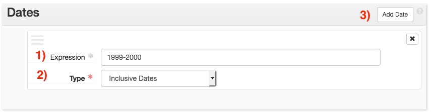

# Archival Object Description
{: .no_toc }

For details on the use of the [Identifiers](aspace/resource-records.md#adding-identifiers), [Agent Links](aspace/controlled-access-terms.md#agent-links), [Subjects](aaspace/controlled-access-terms.md#subject-links), and [Notes](/aspace/resource-records.md#notes-collection-front-matter) sub-forms of the archival object record, please see their corresponding documentation regarding resource records. Use these sub-forms in accordance with NYPL processing guidelines and descriptive best practice.

## Table of Contents
{: .no_toc .text-delta }

- TOC
{:toc}

# Dates
Use the _Dates_ sub-form to describe the dates spanned by the archival object. Refer to [DACS 2.4](https://github.com/saa-ts-dacs/dacs/blob/master/06_part_I/03_chapter_02/04_date.md) for instructions on formulating appropriate dates.

ArchivesSpace allows for multiple date sub-forms. Each sub-form should describe one date or date range. 

When creating dates, additional sub-forms can be generated via the _Add Date_ button (button 3.)

Provide the date in the _Expression_ field (field 1).

Select the type of date in the _Type_ menu (field 2). Select _bulk_ for bulk dates and _inclusive_ for all other dates.

# Extents
Extents should only be provided for archival objects in the following scenarios:

- The archival object represents is audio or moving image recording (AMI), and should be extressed as a number and "audio recording" or "moving image recording."

- The archival object represents electronic records (ER), and should be described as the number computer files and bytes.

- The archival object represents a series, and should be described as the number of containers and linear feet.

## Electronic Record Extents
When describing electronic records, provide the size of the records in the appropriate magnitude of bytes (kilo/mega/giga) as the _Number_, and the unit of measurement as _Type_. Provide the number of computer files in the _Container Summary_ (e.g. 5 computer files).

## Audio and Moving Image Extents
When describing audio and moving image recordings at the archival object level, include the _Number_ of recordings and the _Type_ as either _audio recording_ or _moving image recording_. 

For more information on extents, see the Archival Processing Manual section on [extents](https://nypl.github.io/archival-processing/processing-manual/archival-description/front-matter/#extents). 
