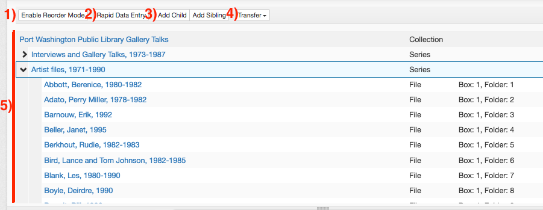
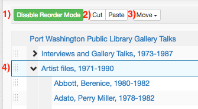
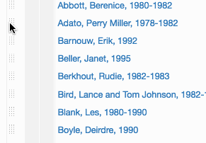
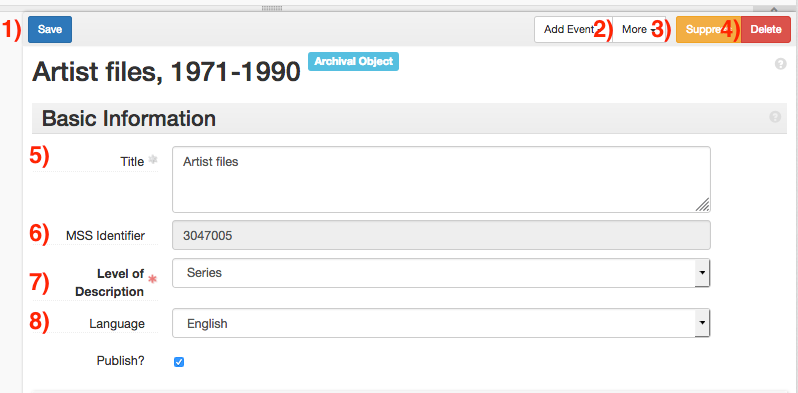

# Archival Objects
{: .no_toc }

In ArchivesSpace, an _archival object_ represents anything below the collection level. Archival objects represent _series_, _subseries_, _files_, and _items_. In EAD, an archival object represents a component. Container lists are formed by creating archival objects within a _Resource_.

## Table of Contents
{: .no_toc .text-delta }

- TOC
{:toc}

## Managing Archival Objects

Archival Objects can only be created within the context of a _Resource_. To create an Archival Object, use the _Add Sibling_ or _Add Child_ buttons (buttons 3). _Add Sibling_ will create a new object at the same hierarchical level as your current record. _Add Child_ will create one directly below it.

The _Transfer_ option (button 4) will move an archival object from one resource to another.

The Rapid Data Entry window can be opened by clicking on _Rapid Data Entry_ (button 2).

### Moving and Re-Ordering Archival Objects

Archival objects can be moved within and between resources with the _Enable Reorder Mode_ button (button 1). Use _Cut_ and _Paste_ (buttons 2) to cut and paste an archival object within a resource’s component hierarchy. Similarly, the _Move_ option (button 3) can be used to more precisely move an archival object around a collection. Archival objects can also be dragged-and-dropped within the hierarchy window (field 4) by clicking-and-holding on the dotted area, which will reorder them within the collection.

Note that multiple components can be selected for dragging-and-dropping by shift-clicking (for a range), or control-clicking (for individual components). To select your components, double click inside the hierarchy window (field 4).

When dragging-and-dropping components, the selected components can be dragged onto another component. From the subsequent menu, choose whether the dragged components should be placed before or after the target component at its level, or as a child of the target component.

**NOTE THAT THERE IS NO UNDO BUTTON FOR REORDERING.** If you move a component to the wrong place in the hierarchy, you will need to manually move it to its correct location. Be extremely careful when moving archival objects around in a resource.

## Archival Object Basic Information
This section explains how to fill out the fields of an archival object. See the [DACS 2.3](https://saa-ts-dacs.github.io/dacs/06_part_I/03_chapter_02/03_title.html) for more information on component titles.

### Title 
Provide the component’s title in _Title_ (field 5). Refer to [DACS 2.3](https://github.com/saa-ts-dacs/dacs/blob/master/06_part_I/03_chapter_02/03_title.md) for more information on the formulation of titles. Do not provide the date in the title, instead provide it in the _Date_ form.

**_Note that titles are not required for components_.** If a component has no title, but a date (e.g. “1900-1910” in the “Correspondence” series), provide the date, but do not provide a title.

### MSS Identifier
The _MSS Identifier_ (field 6) will be automatically generated. Do not provide a value for this field.

### Level of Description
Provide the level of description of the component in the _Level of Description_ menu (field 7). Select a value as follows:

- For series-level components, select _Series_.

- For subseries-level components, select _Subseries._ Choose this only for subseries directly under a Series component.

- For all other components, select _File_.

### Language
Provide the language of the materials being described in the _Language_ menu (field 8). This value will default to English. If the finding describes materials in a language other than English, change this field to _Multiple Languages_ and add a _Language of Materials_ note.

### Suppress
Archival objects can be suppressed by selecting the _Suppress_ button (button 4). Suppressed records will export with an <_audience=”internal”>_ attribute in EAD, will appear as gray in the PDF, and will be treated as nonexistent by systems outside of ArchivesSpace.

### Save
Once an archival record is complete, press _Save_ (button 1) to save the record. 

### Delete
If a record needs to be deleted, press _Delete_ to delete the record. Note that this will also delete all of its child components in the hierarchy. Deleting a record cannot be undone.

### More
The date calculator and extent calculator are available for components under the _More_ menu (button 3). These function the same as the calculators for Resources. Refer to [Using the Extent Calculator]() and [Using the Date Calculator]() for more information.

## Processing Spreadsheet
Larger collections may be easier to process using a spreadsheet rather than in the ArchivesSpace interface or RDE. A spreadsheet [is available 🔒](https://docs.google.com/spreadsheets/d/1TEPAgzKzb5C8IWVkRfHy2--Wj4sMdM6XitKM4ZZiesg/edit#gid=0), which supports basic data entry for components. Spreadsheets should be used for creating component lists only. Collection-level metadata, and any further description of components (e.g. restrictions) should be added following the import of the spreadsheet into ArchivesSpace.

See the section of the Archival Processing Manual on [Entering Data Into The ArchivesSpace Processing Spreadsheet](https://nypl.github.io/archival-processing/processing-manual/processing-collections/entering-data-into-the-archivesspace-processing-spreadsheet/) for additional information on how to fill out each field.
