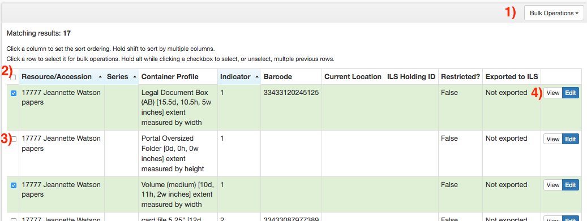
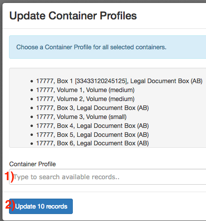
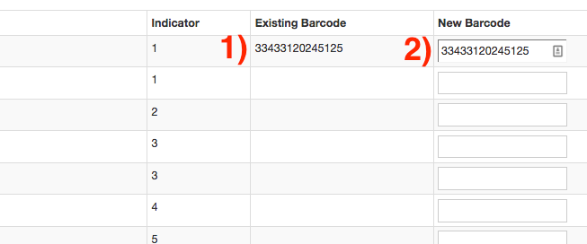

# Bulk Container Management
In addition to working with containers via the Container screen, ArchivesSpace allows for containers to be managed in bulk. This is done via the _Manage Top Containers_ screen, which can be accessed via the gear icon in the toolbar.

Opening this screen will bring up a search menu. Containers can be searched via _Keyword_ (field 1), _Barcode_ (field 2), _Resource_ (field 3), or _Profile_ (field 4.) Once your search parameters are set, select _Search_ (button 5) to search all containers within your repository.

Any containers that match your search query will appear on this screen. Containers can be viewed and managed individually by selecting the _View_ or _Edit_ button (buttons 4). Containers can also be selected via the checkboxes to the far left (box 3), or all at once via the top-left checkbox (box 2). Once the containers that you want to edit are selected, open the _Bulk Operations_ menu (menu 1) to either enter barcodes or assign container profiles.

If you wish to assign container profiles in bulk, select _Update Container Profiles_ from the _Bulk Operations_ menu. The selected containers will appear in a list, along with a field to input the profile that you want to assign (field 1). Once a profile is selected, select the _Update Records_ button (button 2) to assign the container profile, or _Cancel_ to leave the screen without changing any data.

If you wish to assign barcodes in bulk, select _Rapid Barcode Entry_ from the _Bulk Operations_ menu. The selected containers will appear in a list, along with a field to input new barcodes. The existing barcode (if any) will be under the _Existing Barcode_ column (field 1). New barcodes can be input with a scanner or manually in _New Barcode_ (field 2). If a container has an existing barcode assigned to it, this barcode will be repeated in the _New Barcode_ field. Once finished, select _Update Records_ to save the new barcodes.

**Barcodes must be either exactly 14 characters, or left empty**

If any barcodes are malformed, the entire set of records will not be saved. ArchivesSpace will display an error message and provide the opportunity to adjust the barcode.

**If you plan to enter and save barcodes multiple times during one session, you will need to refresh the Manage Top Containers screen after you save each time.** 

Otherwise, barcodes may not be saved.

**Note that removing an existing barcode from the New Barcode field will delete it from the container.** 

If you wish to leave a barcode unchanged, do not edit the value in the _New Barcode_ field.