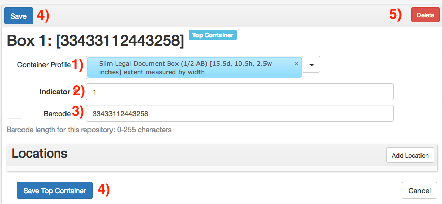

# Container Instances
In ArchivesSpace, a _container_ (or _top container_) represents a circulating container. Containers in ArchivesSpace are equivalent to objects in SPEC and items in Sierra. Typically, containers will represent boxes, volumes, tubes, and oversized folders.

## Container Profile
When creating a container record, provide the type of container in the _Container Profile_ field (field 1). Profiles can be searched by entering search terms into the field, or selected via _Browse_ under the arrow to the right of the field. More information on container profiles can be found at the [ArchivesSpace Container Profiles]() list. When selecting a Container Profile for a newly-processed collection, do not select any profile with _LEGACY_ in the name. These profiles should only be selected when working with older collections.

## Indicator Field
Provide the number of the box in the _Indicator_ field (field 2).

## Barcode
If available at time of processing, provide the barcode in the _Barcode_ field (field 3). Barcodes must be either exactly 14 characters or left empty; the record will not save otherwise._

## Save
 Containers can be saved via the _Save_ buttons (buttons 4). If the Container form was opened from within a resource or archival object page, this will automatically link the container to that record. 

## Delete
Existing containers can be deleted via the _Delete_ button (button 5).