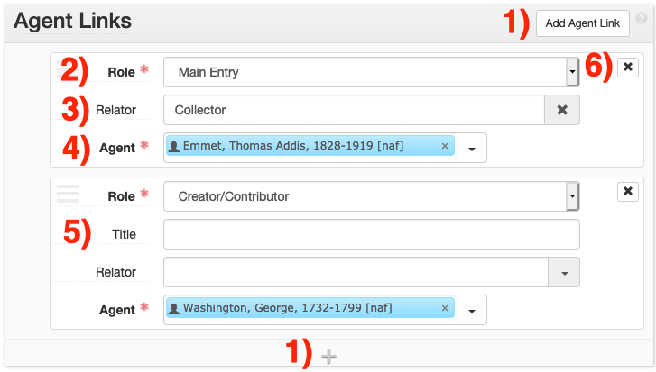
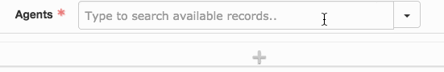
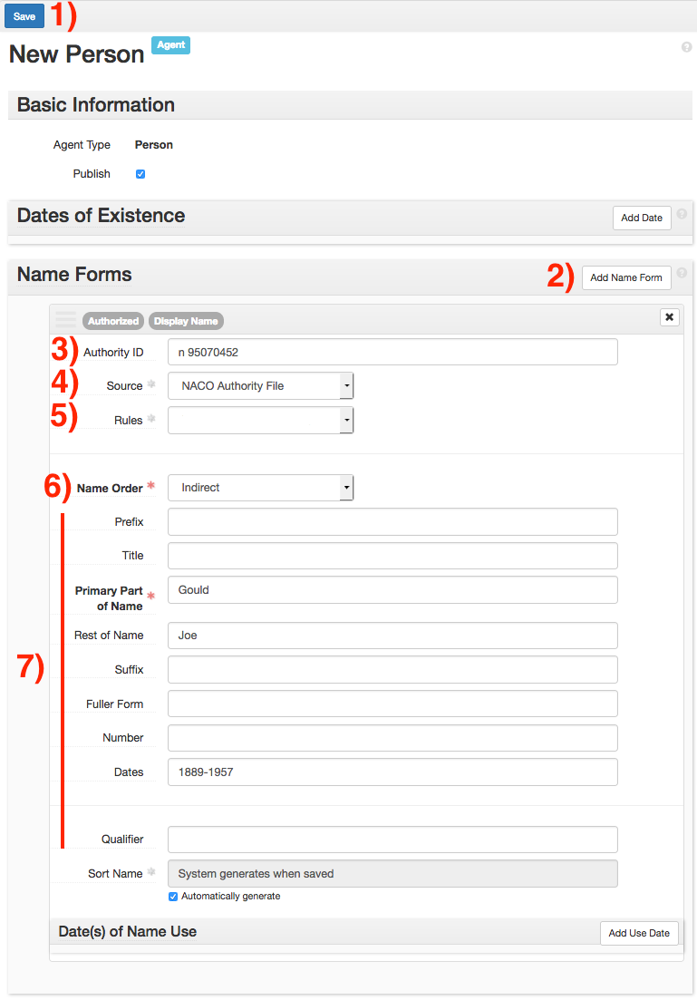
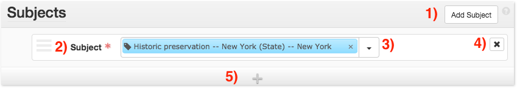
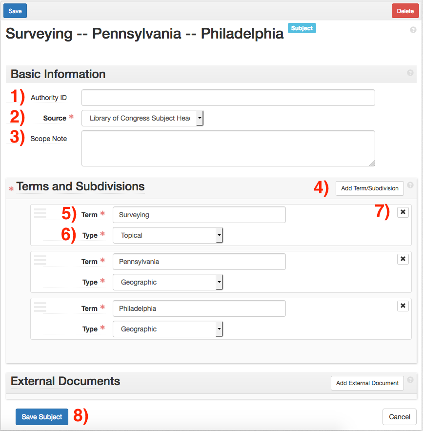

# Controlled Access Terms
{: .no_toc }

After creating the front-matter description for the collection, add controlled access terms. Controlled access terms include agents (personal names, corporate names, family names) and subjects (topics, form/genre, occupations). This section will detail how to create those terms. See the Archival Process Manual section on [controlled access terms](https://nypl.github.io/archival-processing/processing-manual/archival-description/controlled-access-terms/) for additional information. 

## Table of Contents
{: .no_toc .text-delta }

## Agent Links
The _Agent Links_ form allows for name terms to be associated with collections. Name sub-forms can be added by clicking the _Add Agent Link_ button, or the + bar at the bottom of the form (button 1). Each sub-form should contain exactly one name link.

When adding an agent link, select the agent role from the _Role_ menu (field 2). Use the following rules when selecting Roles:

### Main Entry
Select _Main Entry_ ([MARC 1xx](https://www.loc.gov/marc/bibliographic/bd1xx.html)) if the agent is primarily responsible for the creation, assembly, accumulation, and/or maintenance and use of the materials being described. Generally, each collection should have exactly one _Main Entry_, although exceptions may arise for artificial collections when a main entry should not be used. See the [Archival Processing Manual](https://nypl.github.io/archival-processing/processing-manual/archival-description/controlled-access-terms/#main-entry) for more information on working with artificial collections.

### Creator/Contributor
Select _Creator/Contributor_ ([MARC 7xx](https://www.loc.gov/marc/authority/ad7xx.html)) if the agent created material in the collection, or contributed to its creation. You must also provide a _Relator_ term (field 3) that describes the _creator/contributor_ relationship with the collection’s main entry. Choose the term from the Library of Congress [MARC Code List for Relators ](https://www.loc.gov/marc/relators/relaterm.html) list. The most commonly used relator term is _contributor_. 

### Subject
Select Subject ([MARC 6xx](https://www.loc.gov/marc/bibliographic/bd6xx.html)) if the agent is the subject of the collection, but is not represented materially in it. For example, correspondence about a person that is not by or to them would have that person as a _Subject_.

### Subject Terms/Subdivisions
When supplying an Agent Link with the role of _Subject_, you will have the option to provide subdivisions under the _Terms/Subdivisions_ form. Use this form to provide subdivisions to names used as subjects (e.g. Columbia University -- Students).If an agent is represented by multiple roles in a collection (e.g. the main entry is also the subject of the collection), provide one agent link per role. Do not provide a secondary _Creator/Contributor_ agent link for the _Main Entry_.

### Searching For Agents
Provide the agent link in the _Agents_ field (field 4). If the agent already exists in ArchivesSpace, it can be searched within the Agents field. Otherwise, the agent can either be found via _Browse_, or created via _Create_, under the drop-down menu to the right of the Agents field.

Agents can be detached from a collection via the x button (button 6). Note that detaching an agent from a collection will not delete that agent from ArchivesSpace, it will only remove it from that collection.

### Creating New Agents
**Before creating new subjects/agents in ArchivesSpace, please read the [Archival Processing Manual](https://nypl.github.io/archival-processing/processing-manual/archival-description/controlled-access-terms/#agents) section on creating agents records**.

When creating name entries (families, persons, corporate bodies), use the _Agent_ screen.

Provide each part of the name in its appropriate field (e.g. surnames in _Primary Part of Name_, suffices in _Suffix_.) Do not enter data in the _Dates of Existence, Contact Details, Notes, Related Agents, External Documents,_ or _Rights Statements_ sub-menus unless otherwise specified. Instead, provide vital dates under _Dates_.

Additional name forms can be provided by clicking _Add Name Form_ (button 2). This allows for the input of pseudonyms.

Provide the identifier of the name in _Authority ID_ (field 3), when available. Information on which identifier to use is available in the [Processing Manual](https://nypl.github.io/archival-processing/processing-manual/archival-description/controlled-access-terms/#creating-new-agents).

Provide the source of the authorized name in _Source_ (field 4). A list of acceptable sources is available in the [Processing Manual](https://nypl.github.io/archival-processing/processing-manual/archival-description/controlled-access-terms/#creating-new-agents). If the name is not from an external authority, use _Local Unauthorized_.

If the rules used to create the name are known, provide this value in _Rules_ (field 5). All locally-created names should follow the rules set out in [RDA Toolkit, Chapter 9](http://original.rdatoolkit.org/rdachp9_rda9-759.html). Do not provide a value for names found in an authority.

Provide the name order in _Name Order_ (field 6). If a name is formatted as _First Last_, use _Direct_. If a name is formatted as _Last, First_, use _Indirect_.

Provide the name’s parts in the fields provided (fields 7). Follow the formatting in the term’s authority record when filling out these fields.

When finished, click _Save Person_ (button 1) to save the record. If you created the agent from the _Resource_ or _Archival Object_ screen, this will automatically link the record to the agent. If you wish to create many agents at once, clicking _+1_ will save the current record and immediately open a new Agent screen.

## Subject Links
The _Subject_ form allows for subject terms to be associated with _collections/components._ The following term types of terms can be found in the Subject form:

- Subjects

- Genres/Forms

- Occupations

- Geographic terms

**Do not provide Name subjects via the Subject form. Names should always be created using the [Agent Links](#agent-links) form.**

Subject sub-forms can be added by clicking the _Add Subject_ button (button 1) or the + at the bottom of the form (button 5). Each sub-form should contain exactly one complete subject heading.

Existing subject terms can be searched via the _Subject_ field (field 2). Selecting the subject will associate it with the _collection/component_. If a subject does not appear in a search, click on the drop-down arrow (button 3), and select either _Browse_ or _Create_. 

_Browse_ will open a list of all subject terms in ArchivesSpace. Selecting a term from this list will associate it with the collection/component. 

_Create_ will open up a form to create a new subject, and associate it with the _collection/component_.

Subjects can be detached from a collection/component via the **_x_** button on the right (button 4). Note that even if a subject is detached, the subject record will still exist in ArchivesSpace.

### Creating New Subjects
Please refer to the [Archival Processing Manual](https://nypl.github.io/archival-processing/processing-manual/archival-description/controlled-access-terms/#subjects) for information on rules and policies regarding creating access terms. When creating non-name subject terms, always use the Subject sub-menu.

Provide the authority ID for the subject term in _Authority ID_ (field 1). Use the following rules when providing authority IDs:

| Source | Rule |
| ----- | ----- |
| [LCSH](https://authorities.loc) | Provide the LC Control Number. Only provide an identifier for headings without subdivisions. Do not provide an identifier for subdivided terms. |
| [LCGFT](https://id.loc.gov/authorities/subjects.html) | Provide the LC Control Number from the authority record. |
| [AAT](https://www.getty.edu/research/tools/vocabularies/aat/) | Provide the URL of the term’s _Semantic View_ page (e.g. <http://vocab.getty.edu/aat/300263144>.) Capitalize the first letter of the first word, but leave the rest lowercase. |
| [ITOAMC](https://folgerpedia.folger.edu/Index_terms_for_occupations_in_archival_and_manuscript_collections_\(ITOAMC\)) | Do not provide an ID. |

**Before editing existing IDs, or supplying IDs not in adherence to these rules, talk to your supervisor.**

Provide the authority source of the subject term in the _Source_ drop-down menu (Field 2).

Do not use _Scope Note_ (Field 3).

Click the _Add Term/Subdivision_ button (Field 4) until the needed number of term fields are present. For example, _Surveying -- Pennsylvania -- Philadelphia_ will have three term fields.

Provide each subdivided term in its own _Term_ field (Field 5). Select the type of term from the term _Type_ drop-down (Field 6). For [LCSH](https://authorities.loc.gov/), use the term types of _Temporal_, _Topical_, _Uniform Title_, or _Geographic_ as appropriate. For [AAT](https://www.getty.edu/research/tools/vocabularies/aat/) and [LCGFT](https://id.loc.gov/authorities/subjects.html), select _Genre/Form_. 

Subdivisions can be removed by clicking on the **_x_** __button (button 7) in the appropriate subdivision sub-form. Subdivisions can be rearranged by clicking and dragging the three-line icon on the top left of the subdivision form.

When the subject record is complete, click the _Save Subject_ button (Field 8) to save the record. If you navigated to the Subject screen using the _Create_ option in the _Resource/Archival Object_ screens, the subject will be automatically linked to the respective _Resource/Archival Object_.

