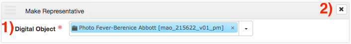

# Digital Objects

Digital Objects can be linked to resources and archival objects using the _Instances_ form by selecting _Add Digital Object_. Provide the digital object by searching for it in the _Digital Object_ field (field 1). If you are not able to find it, you can browse all digital objects using the _Browse_ option in the pulldown menu.

Digital object links can be removed by clicking the **_x_** __button (button 2) on the sub-form. Note that this will not delete the digital object record, but instead only remove its association to the resource/archival object.
