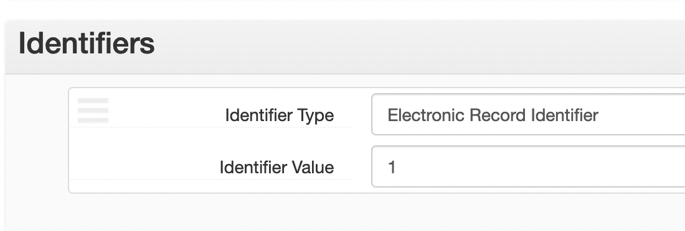

# Electronic Records
Electronic records can be attached to components by adding an _Identifier_. Electronic record identifiers should use _Electronic Record ID_ as the _Type_ and the number of the ER (without any prefix) as the _Identifier_.

