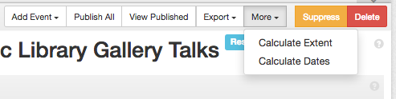
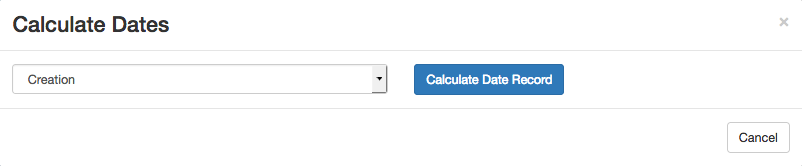
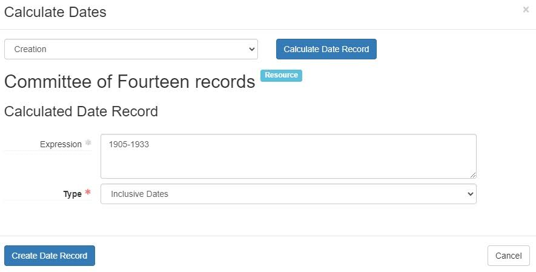
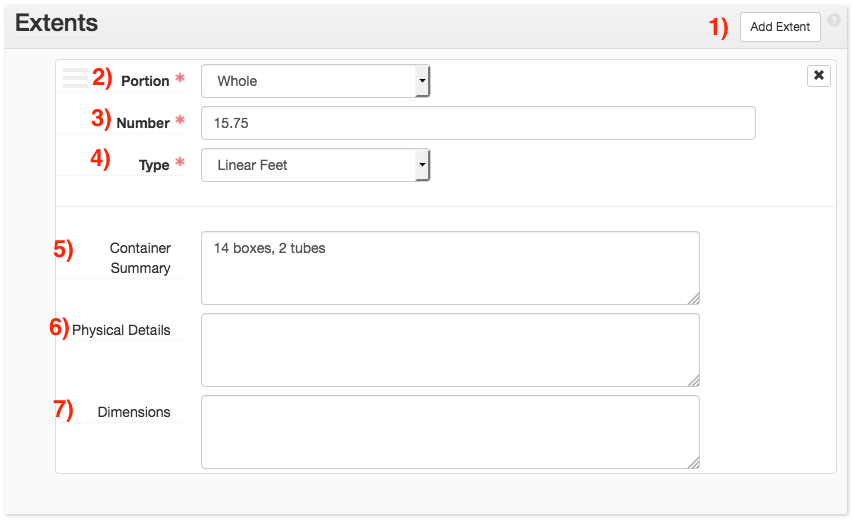
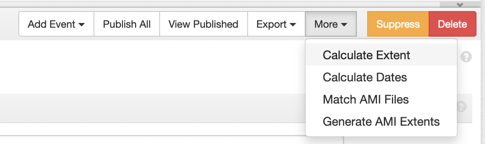
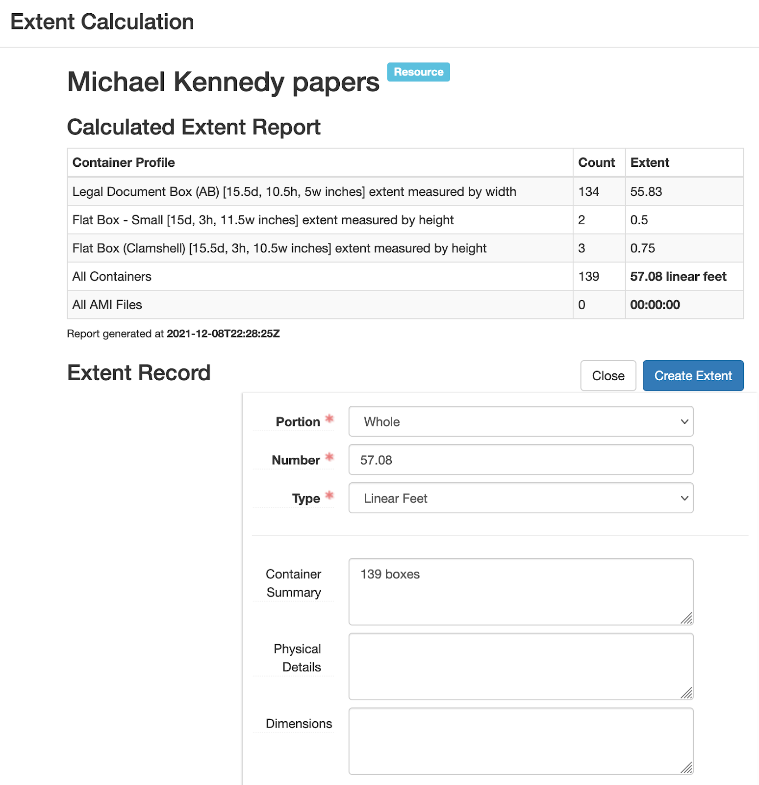
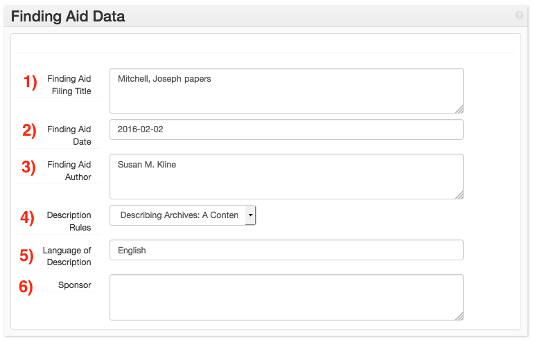

# Front Matter
{: .no_toc }
This section explains how to fill out the fields of the finding aid front matter in the collection's resource record. 

## Table of Contents
{: .no_toc .text-delta }

- TOC
{:toc}

# Resource Dates
For collections, provide dates according to [DACS 2.4](https://github.com/saa-ts-dacs/dacs/blob/master/06_part_I/03_chapter_02/04_date.md). If the use of a bulk date is appropriate for the collection, provide the bulk date in a separate date sub-form with the _Type_ of _bulk_.\

For more information on the fields in the Dates subform, see [Archival Object Dates](../aspace/archival-object-description.md#dates) section of this guide.

## Using the Date Calculator
ArchivesSpaces provides a date calculator, which will automatically find the earliest and latest dates in a collection and create a Date record for them. The Date Calculator will find the dates of each component under the current record, compare to find the earliest and latest dates, and generate a Date record using the range provided. Note that the Date Calculator will not provide information on bulk dates - it will only provide the total span for the record.The Date Calculator can be accessed under the _More_ menu from the Resource and Archival Object screen.

Selecting _Calculate Dates_ will open the Date Calculator, which will ask for which type of date to find. Since all dates in a collection are set to _Creation_ by default, this can be left as-is. Select _Calculate Date Record_ to begin finding the date spans.

Doing so will begin the date calculation process. For larger collections, this may take some time. Once the calculator has finished, it will provide a Date form with the calculated date span provided.

Selecting Create Date Record will save the Date form to the Resource/Archival Object that the Calculator was opened from. If you edit the finding aid after calculating the dates, you will need to re-calculate the dates to include the edits. The form does not automatically update.

# Extents

The physical coverage of a collection is described using the _Extents_ sub-form. Much like dates, ArchivesSpace describes each aspect of the extent in separate sub-forms. For example, the extent of paper materials (i.e., boxes and linear feet) should be separate from the extent of the electronic records (i.e., files and bytes). To add a new extent sub-form, click on the _Add Extent_ button (button 1).

Describe the relationship of the described extent to the entirety of the collection/component using the _Portion_ menu (field 2). If the extent described encompasses the entirety of the collection/component (for example, the collection consists only of papers in boxes), select _Whole_. If the material described only partially encompasses the collection/component (for example, the collection consists of physical boxes, electronic records, and audio and moving image material), select _Part_.

Provide the number of the extent in the _Number_ field (field 3). Provide the type of the extent in the _Type_ field (field 4). For example, a collection spanning 58.83 linear feet would have a _Number_ of “58.83” and a _Type_ of “linear feet." If the extent is describing electronic records, provide the size in bytes as the _Number_ and the unit (kilobytes, megabytes, gigabytes, etc.) in the _Type_.

Provide the container description for collections in the _Container Summary_ field (field 5). If a collection includes electronic records, provide the number of files in _Container Summary_. 

Do not use _Physical Details_ or _Dimensions_ (Fields 6 and 7) unless otherwise appropriate.

## Guidelines for Collection Extent
When providing extent metadata for resource records, follow these guidelines for data entry:

1\. Provide the linear footage of the collection using the _Number_ field, with a _Type_ of “linear feet” and a _Portion_ of “whole."

2\. Describe the container breakdown of the collection under _Container Summary_ (e.g. “27 boxes, 6 volumes, 1 oversize folder.) Do not include AMI or electronic records.

Describe any non-boxed material, such as AMI and electronic records, in a separate Extent sub-form. Provide a _Portion_ of “Part” (unless this encompasses the entire collection.) For electronic records, use the rules as established above.

## Using the Extent Calculator
ArchivesSpace provides a built-in Extent Calculator, which will automatically provide the linear footage and number of items in a given collection/series. The Extent Calculator can be accessed by clicking on the _Calculate Extent_ option under the _More_ menu at the top of the data entry screen for each collection/component.

Once opened, the Extent Calculator will provide a list of all Container Types under the current record, the total number of each type, and their sum linear footage. If the Extent Calculator is opened for a collection, it will provide information on all containers in the collection. If it is opened for a component, it will provide the sums only for the containers within and under the current component (e.g. all containers in a single series).

Clicking on _Create Extent_ will save the Extent Record to the current record. Note that, while the _Container Summary_ may not follow local standards, this can be edited from within the Extent Calculator before saving.

**Note that Portal containers (Portal Box, Portal Tube, etc.) have no linear footage.** These container types will need to be updated before using the Extent Calculator. If you are processing additions to a collection that was imported from the Archives Portal, the Extent Calculator may not provide accurate linear footage.

Electronic record extents will be calculated along with physical records. Note that electronic record extents use decimal orders of magnitude (i.e. 1000-byte kilobytes) instead of binary. 

AMI extents are calculated using a SQL query of the database. The Senior Manager or Manager of Archival Processing can calculate these extents for you. 

# Finding Aid Data

**Finding Aid Filing Title**

Provide the name of the finding aid in _Finding Aid Filing Title_ (field 1). If the finding aid title begins with a name, provide that name in indirect order (e.g. “Wolfe, Tom papers”).  Otherwise, provide the name as-is (e.g. “St. Philip’s Church records”).

**Finding Aid Date**

This field is completed after the finding aid is published to the Archives Portal. The date of publication should be ended as YYYY-MM-DD in _Finding Aid Date_ (field 2).

**Finding Aid Author**

Provide the name(s) of the original author(s) of the finding aid in _Finding Aid Author_ (field 3). Do not provide the names of authors of revisions; provide that information in the _Revision Statement_ instead.

**Description Rules**

Provide the rules used to formulate description in the _Description Rules_ field (field 4). In all cases, this value will be _DACS_.

**Language of Description**

Provide the language used by the finding aid in _Language of Description_ (field 5). In all cases, this value will be _English_.

**Sponsor**

Provide the sponsor of the collection, if necessary, in the _Sponsor_ field (field 6). Use the language provided by the deed of gift or purchase agreement.

# Revision Statement
The _Revision Statement_ form allows for recording information about changes made to a finding aid. Do not create _Revision Statement_ records when creating a finding aid for the first time. Only complete this field when describing additions or revisions to a collection. Provide the nature and extent of the revision (e.g. Boxes 7-10 processed by \<name>Anne Archivist\</name>).

! [revision statement](../aspace/Images/67-revision-statement.png)

Whenever a change, update, or addition is made to a previously processed finding aid, create a _Revision Statement_ record. Sub-forms can be generated by clicking the _Add Revision Statement_ button (button 1).

Record the date that the revision was completed in the _Revision Date_ field (field 2). Use YYYY-MM-DD format to record the date.

Describe the nature of the revision in the _Revision Description_ field (field 3). Include the name of all archivists involved in the revision in this field.

