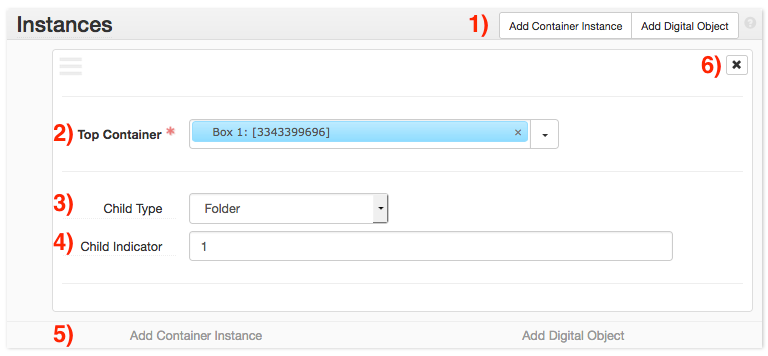
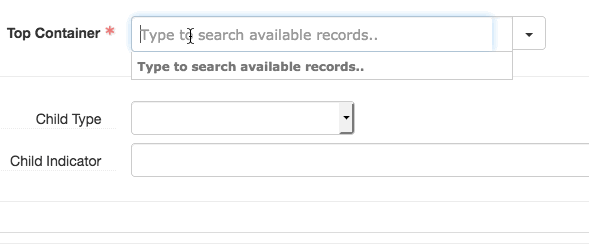

# Instance Links
The _Instance_ form is used to link collection and component records to container records and digital objects. Container records represent boxes, tubes, volumes, and oversized folders.

Instance sub-forms can be added by clicking the _Add Container Instance_ button (buttons 1), or its corresponding button at the bottom (buttons 5). Add an Instance sub-form for each container associated with an archival object (e.g. an archival object describing 5 boxes should have 5 Instances).

Provide the link to the appropriate container in the _Top Container_ field (field 2). Containers can be searched by typing into the _Top Container_ field (see above). This will only search containers already associated with the collection. If the container does not already exist (or is not already associated with the collection), further options can be found by clicking the triangle to the right of the field. The _Create_ option will bring up a window to create a new container. The _Browse_ option will bring up an advanced search window for finding containers.

If more detailed description of the archival object’s container is needed (for example, if the component represents a range of folders within a box), provide this information in the _Child Type_ and _Child Indicator_ fields. Select the type of child container from the _Child Type_ menu (field 3), and provide its number (or range of numbers) in _Child Indicator_ (field 4). For example, if an archival object describes folders 2-5 in a box, the _Child Type_ would be _folder_ and the _Child Indicator_ would be _2-5_.

