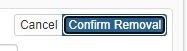

# Notes on Saving
ArchivesSpace will **NOT** save records automatically. If you navigate away from a screen without first clicking _Save_, your data will be lost. Records should be saved frequently to prevent data loss.

If you need to delete an element from a record in ArchivesSpace (e.g. removing a Date or Note), you will need to **fully delete the element** by clicking the **_x_** on the form followed by the _Confirm Removal_ button. 

Records cannot be saved if required fields are missing from any sub-element; for example, deleting a Date’s Expression will render the record un-savable until the Date form is removed

