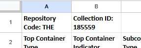

# Processing Spreadsheet
{: .no_toc }

Larger collections may be easier to process using a spreadsheet rather than in the ArchivesSpace interface or RDE. A spreadsheet [is available 🔒](https://docs.google.com/spreadsheets/d/1TEPAgzKzb5C8IWVkRfHy2--Wj4sMdM6XitKM4ZZiesg/edit#gid=0), which supports basic data entry for components. Spreadsheets should be used for creating component lists only. Collection-level metadata, and any further description of components (e.g. restrictions) should be added following the import of the spreadsheet into ArchivesSpace.

This section includes instuctions on how to import the processing spreadsheet, and how to troubleshoot imports. See the section of the Archival Processing Manual on [Entering Data Into The ArchivesSpace Processing Spreadsheet](https://nypl.github.io/archival-processing/processing-manual/processing-collections/entering-data-into-the-archivesspace-processing-spreadsheet/) for additional information on how to fill out each field.

## Table of Contents
{: .no_toc .text-delta }

- TOC
{:toc}

# ArchivesSpace Component Spreadsheet Import Instructions
This workflow provides instructions on how to import a completed [ArchivesSpace Component Spreadsheet Spreadsheet 🔒](https://docs.google.com/spreadsheets/d/1TEPAgzKzb5C8IWVkRfHy2--Wj4sMdM6XitKM4ZZiesg/edit#gid=0) into a resource record in ArchivesSpace. When working in the spreadsheet it is important that you do not modify the formatting or column names. Any changes will cause the import into ASpace to fail. Follow the steps below to assure that your processing spreadsheet imports correctly. 

## Spreadsheet Review
The top row of the spreadsheet has two cells: _Repository Code_ and _Collection ID_ and must include the following data:

**_Repository Code_:** Enter the three-character code for the repository (e.g. MSS, THE, SCM)

**_Collection ID_:** Enter the SPEC Collection IdentifierMake sure to leave only one space between the colon and the code/number as illustrated below.

Make sure to leave only one space between the colon and the code/number as illustrated below.

Before performing the import, you must make sure all the data in your spreadsheet has been converted to plain text. It is recommended that you work in Google Sheets to perform this task. 

1\. In Google Sheets Navigate to _Format > Number > Plain Text.

2\. Review the spreadsheet to make sure the data looks correct, and look out for issues such as missing blocks of data or alignment issues. 

3\. When the spreadsheet looks correct, navigate to _File_> _Download_ > _Microsoft Excel (.xslx)_

## Importing a Processing Spreadsheet into ASpace
1\. Open ASpace and navigate to the correct repository. 

2\. Go to Create > Background Job > Import Data.

3\. This will open up the _New Background Job - Import Data_ screen. Select _Components spreadsheet_ from the drop-down menu.

4\. Click on the green _+ Add file_ button, and select the XSLX file you downloaded, or drag the file into the _+Drag and drop files here_ section of the screen.

5\. Click the blue _Queue Job_ button.

6\. ASpace will notify you if there are any errors. Otherwise, you will see a success message.

## Troubleshooting Failed Imports
The importer mostly handles errors clearly, and will not create any records until the entire job succeeds. When there are errors, the box in the Job screen will display the row where the import failed on and a message about the problem. 

For example, if you entered _folder_ in the _Subcontainer Type_ field, but did not put a number in the _Subcontainer Indicator_, the importer will fail and display a message about “missing subcontainer values at row X.”

Another common error is regarding _file markers._ This error happens when a spreadsheet is not exported directly from Google Sheets. If this comes up, make sure that the spreadsheet is saved as a Google Sheet in Drive (it won’t say “.XSLX” next to the title), then export it again as an  XSLX file.

If you cannot figure out why your import failed, submit a [ServiceNow 🔒](https://nyplprod.service-now.com/nyplsp) ticket.
