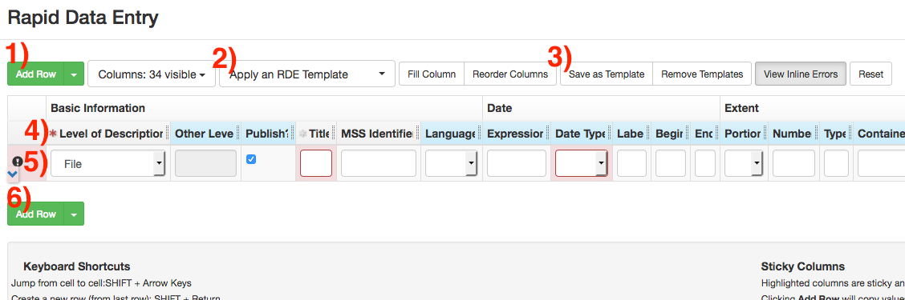

# Rapid Data Entry
Rapid Data Entry (RDE) can _not_ be used for creating hierarchical description. RDE can only be used for creating single levels of hierarchy (e.g. long lists of correspondents in a Correspondence series).

The _Rapid Data Entry_ screen can be used to quickly create lists of components. When you select the _Rapid Data Entry_ button on a Resource or Archival Object screen, the RDE will place any components created in it under that Resource or Archival Object (e.g. opening the RDE at the series level will create components as a subseries under it.)

Opening the RDE screen will begin with one empty row. Additional rows can be added with the _Add Row_ button (Button 1 or 6.) Multiple additional rows can be added using the drop-down arrow on the button.

The RDE screen defaults to showing all possible data fields at once. These can be limited by using templates, which will remove unneeded fields and supply default values. Templates can be selected with the _Apply an RDE Template_ button (Button 2). You can also create your own template by adding/removing/populating columns (using the _Columns_ drop-down) and save it with the _Save As Template_ button (button 3).

RDE will automatically create containers by adding Container Indicator fields, or will automatically link new components to existing containers. For example, if Box 2 was already created and linked to a component in the collection, then adding a container with Indicator of “2” will link that component to the existing Box 2. If Box 2 did _not_ already exist, then creating a component with an Indicator of “2” will create that container and link it to the collection. Note that these containers will not have Container Profiles associated with them. You will need to update the containers late using the [Bulk Container Management](../aspace/bulk-container-management.md) screen.

Once your component list is completed, select _Save_ at the bottom of the screen to save your work and close the RDE screen. Since the RDE will always create components at the bottom of the selected series/subseries, it is recommended to periodically save your work in order to avoid data loss.