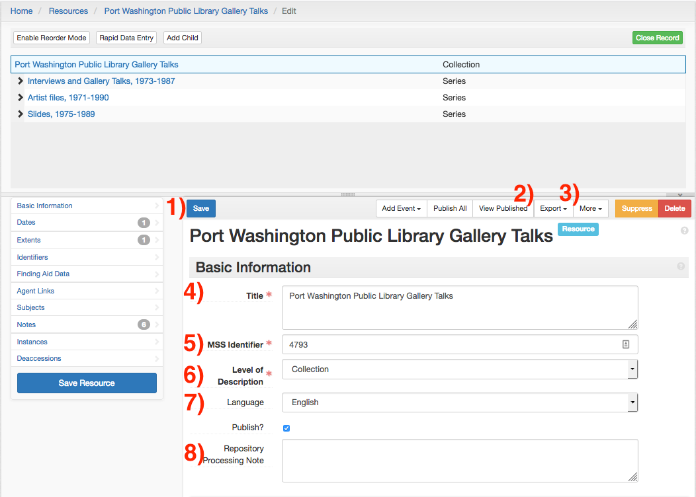
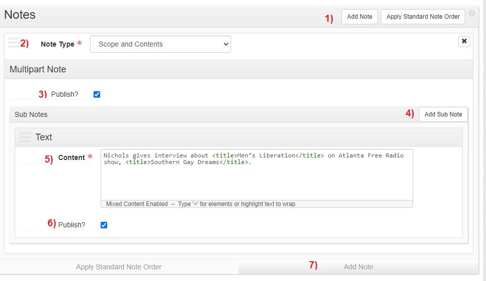
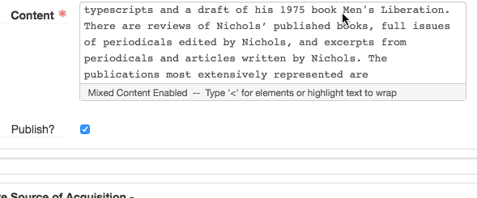

# Resource Records
In ArchicesSpace a resource record is ArchiveSpace’s name for an archival collection record. Resource records for new acquisitions are created by Archival Processing management after the aquisition is accessioned or a backlog collection is identified for processing. Resource records for legacy collections that are published _only_ on the [Archives Portal](https://archives.nypl.org/) are created by importing the EAD XML file into ArchivesSpace. 

If you are working on revisions or additions to a legacy collection that is not in ArchivesSpace, you can request an import through the [Archival Processing Description Remediation Form 🔒](https://sites.google.com/nypl.org/specialcollections/special-collections-processing/archival-processing/description-remediation)

Collections are created by selecting _Resource_ under the _Create_ menu at the top of the screen. Collections will generally be created ahead of time as part of accessioning or import from the Archives Portal.

A collection’s description can be saved by pressing the _Save_ button (button 1). Note that if every field marked by a red asterisk is not filled out, the collection cannot be saved.

A collection can be exported as EAD, PDF, or MARCXML by selecting _Export_ (button 2). More information on exporting finding aids can be found under the [Exports](h) section.

The Extent Calculator and Date Calculator are available under the _More_ menu (button 3). More information on these functions is available under [Wrapping Up Resources]().

## Basic Information
Provide the collection’s title in the _Title_ field (field 4). Titles should comply with [DACS 2.3](https://github.com/saa-ts-dacs/dacs/blob/master/06_part_I/03_chapter_02/03_title.md).

Locate the MSS ID from SPEC and enter it into the _MSS Identifier_ (field 5). **Do not create a collection without an identifier.** Provide the MSS ID as a number, with no “MssCol” prefix. 

Provide the level of description in the _Level of Description_ field (field 6). For all Resources, this **must** be set to **_Collection_**, even though it will initially default to _file._

Provide the language of the collection’s material in the _Language_ field (field 7). If more than one language is present, select _Multiple Languages_, _and describe the languages in a _Language of Materials_ note.

## Notes (Collection Front Matter)
The _Notes_ form supports the creation of free text description about a collection. For example, the _Notes_ form is used to create a collection level _scope and content_ notes and _immediate source of acquisition_ note for acquisition information. Please refer to [DACS](https://saa-ts-dacs.github.io/) and the [EAD](https://www.loc.gov/ead/tglib/element_index.html) standards for more information on the appropriate type, content, and encoding of notes. 

The requirements and standards for collection-level description are available in the Processing Manual in the sections on [Front Matter](https://nypl.github.io/archival-processing/processing-manual/archival-description/front-matter/) and [Finding Aid Notes](https://nypl.github.io/archival-processing/processing-manual/archival-description/finding-aid-notes/). 

Some access notes are automatically generated by the Archives Portal. See the section on this user guice [Standard Access Notes]() for more information, and the [Finding Aid Notes](https://nypl.github.io/archival-processing/processing-manual/archival-description/finding-aid-notes/) section of the Archival Processing Manual for more information.

[Processing information](https://nypl.github.io/archival-processing/processing-manual/archival-description/finding-aid-notes/#processing-information) notes should be formatted as: 

Processed by \<name>Anne Archivist\</name> in \<date>2016\</date>.

Additional note sub-forms can be added via the _Add Note_ button (buttons 1, 7). 

The note type is declared by selecting a type from the _Note Type_ menu (field 2).The _Add Sub Note_ button (button 4) will create additional sub-forms to enter additional paragraphs. 

Enter the text of the note into the _Content_ field (field 5).

Use [EAD](https://www.loc.gov/ead/tglib/element_index.html) XML tags (e.g. \<persname>, \<title>) in note text. Alternatively, by highlighting note text, a pop-up menu of options will appear. Selecting one will wrap the text in the corresponding tag. 

For more information on available tags, please see the [Inline XML Markup]() chart. 

**ArchivesSpace will not provide automatic punctuation on any notes.** Any trailing punctuation will need to be provided in the forms. Automatic trailing punctuation is _only_ provided for [Subject Links]() and [Agent Links]() in the MARCXML.

