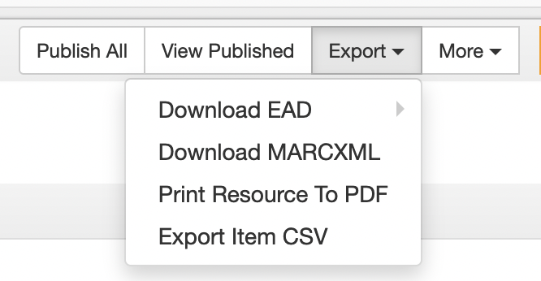
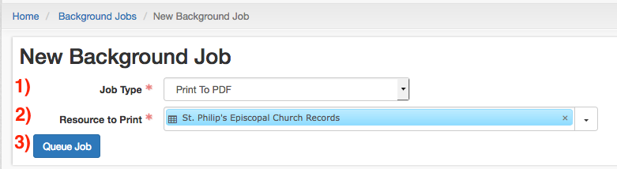
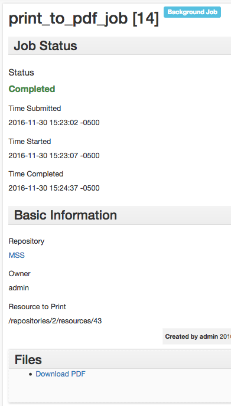
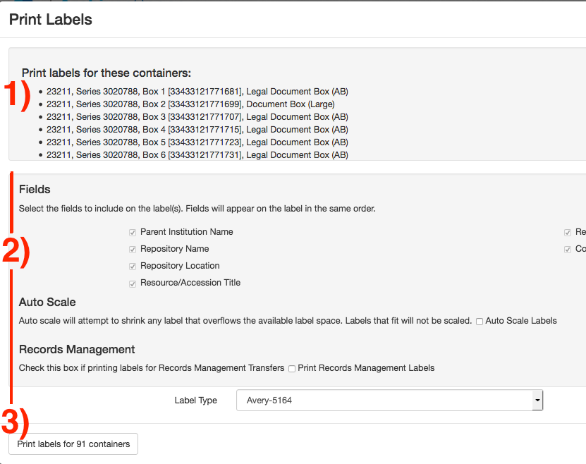

# Wrapping Up
{: .no_toc }

## Table of Contents
{: .no_toc .text-delta }

This section covers the final steps and review before completing your finding aid.

- TOC
{:toc}

# Final Review
Before finalizing the the finding aid, review the following:

1\. **Is the collection description** [DACS](https://saa-ts-dacs.github.io/) **compliant?** Not all required DACS elements are required in ArchivesSpace.

2\. **Are all** [locally-required fields](https://nypl.github.io/archival-processing/processing-manual/archival-description/finding-aid-notes/#required-fields) **present?** ArchivesSpace does not necessarily enforce fields required by local standards.

3\. **Are containers properly created and linked to their corresponding components?** Please refer to [**Container Instances**](../aspace/container-instance.md) for guidelines on creating and linking containers.

4\. **Are access terms properly linked to the collection, and were new terms properly created?** Please refer to the [Archival Processing Manual](https://nypl.github.io/archival-processing/processing-manual/archival-description/controlled-access-terms/) for guidelines on creating new access terms.

# ArchivesSpace Mappings to MARC/EAD/DACS
The mappings between ArchivesSpace to MARC, EAD, and DACS can be found [here 🔒](https://docs.google.com/spreadsheets/d/1T-dHr9z_090suUXfMsta8BRGClRsjohc99qR-Uq_KQc/edit?usp=sharing). The chart below lists the available XML tags in ASpace, as well as if and when they should be used. 

Each XML tag links to its definition in the [EAD 2002 tag library](https://www.loc.gov/ead/tglib/element_index.html), and some descriptive text links to the [Archival Processing Manual](../processing-manual/archival-processing-at-nypl.md). 

## Inline XML Markup

| **Tag** | **Definition** |
| ------- | -------------- |
| [language](https://www.loc.gov/ead/tglib/elements/language.html) | Use for [Language of Material](https://nypl.github.io/archival-processing/processing-manual/archival-description/finding-aid-notes/#language-of-material) notes. Wrap language names in this tag (e.g. Materials in \<language>English\</language> and \<language>French\</language>). |
| [blockquote](https://www.loc.gov/ead/tglib/elements/blockquote.html) | Do Not Use. |
| [date](https://www.loc.gov/ead/tglib/elements/date.html) | Use for [Processing Information](https://nypl.github.io/archival-processing/processing-manual/archival-description/finding-aid-notes/#processing-information) notes. Wrap the year that the collection was originally processed in with this tag (e.g. Processed by \<name>Anne Archivist\</name> in \<date>2016\</date>). |
| [function](https://www.loc.gov/ead/tglib/elements/function.html) | Do Not Use. |
| [occupation](https://www.loc.gov/ead/tglib/elements/occupation.html) | Do Not Use. Provide collection-level occupations as linked [subjects](https://nypl.github.io/archival-processing/processing-manual/archival-description/controlled-access-terms/#subjects). |
| [subject](https://www.loc.gov/ead/tglib/elements/subject.html) | Do Not Use. Provide collection-level linked [subjects](https://nypl.github.io/archival-processing/processing-manual/archival-description/controlled-access-terms/#subjects). |
| [emph](https://www.loc.gov/ead/tglib/elements/emph.html) | Use to provide stylistic formatting. Wrap the text that you wish to italicize in \<emph> tags (e.g. The \<emph>Titanic\</emph> sank in 1912). Do not use \<emph> for titles; see \<title>. |
| [corpname](https://www.loc.gov/ead/tglib/elements/corpname.html) | Do not use. Provide collection-level names as linked [agents](https://nypl.github.io/archival-processing/processing-manual/archival-description/controlled-access-terms/#agents) |
| [persname](https://www.loc.gov/ead/tglib/elements/persname.html) | Do not use. Provide collection-level names as linked [agents](https://nypl.github.io/archival-processing/processing-manual/archival-description/controlled-access-terms/#agents) |
| [famname](https://www.loc.gov/ead/tglib/elements/famname.html) | Do not use. Provide collection-level names as linked [agents](https://nypl.github.io/archival-processing/processing-manual/archival-description/controlled-access-terms/#agents) |
| [name](https://www.loc.gov/ead/tglib/elements/name.html) | Use when providing your name in the [Processing Information](https://nypl.github.io/archival-processing/processing-manual/archival-description/finding-aid-notes/#processing-information) fields. |
| [geogname](https://www.loc.gov/ead/tglib/elements/geogname.html) | Do not use; provide collection-level places as linked [geographic](https://nypl.github.io/archival-processing/processing-manual/archival-description/controlled-access-terms/#subjects) subjects. |
| [genreform](https://www.loc.gov/ead/tglib/elements/genreform.html) | Do not use. Provide collection-level [genres](https://nypl.github.io/archival-processing/processing-manual/archival-description/controlled-access-terms/#subjects) as linked [subjects](https://nypl.github.io/archival-processing/processing-manual/archival-description/controlled-access-terms/#subjects) |
| [title](https://www.loc.gov/ead/tglib/elements/title.html) | Use to provide titles within notes. Wrap the text of the title in \<title> tags (e.g. Shelley’s \<title>Frankenstein\</title>”). The <title> tag will provide the necessary italicization of the text. | 
| ref | Do Not Use. | 
| extref | Do Not Use. |

# Exports
ArchivesSpace allows for the export of MARCXML, EAD, PDF, and a CSV of a resource’s containers.

## PDF
Finding aids can be exported as PDF files using the _Export_ button in the Resources page. Selecting _Print Resource to PDF_ will take you to the New Background Job screen.

Select _Print to PDF_ from _Job Type_ (field 1).Select the collection to generate a finding aid for from _Resource to Print_ (field 2). Collections can be searched by typing into the field, or selected via the _Browse_ option under the drop-down menu on the right.

Clicking _Queue Job_ (button 3) will begin the process of generating a PDF to download. Once the job is queued, ArchivesSpace will open a new page, which monitors the progress of the PDF generation. Once the page’s Status updates to _Completed_, refresh the page. A _Download File_ link will appear on the page under “Files.” **Note that PDF finding aids are for internal use only, and will not necessarily reflect how finding aids will appear in the Archives Portal.**

If you receive an error when generating a PDF, export the finding aid’s EAD XML and validate it in an XML editor such as [Oxygen](https://www.oxygenxml.com/) or [XML Validation](https://www.xmlvalidation.com/). Most errors in PDF generation are caused by mismatched or malformed XML tags in component titles, which will be detected by an XML validator.

See our internal [troubleshooting guide 🔒](https://github.com/NYPL/archival-processing-admin/blob/main/ArchivesSpace/troubleshooting.md) for more tips on troubleshooting your export. If you cannot figure out the issue, file a [ServiceNow ticket 🔒](https://nyplprod.service-now.com/nyplsp).

## MARC
Collection-level description can be exported as MARC XML using the _Export_ button in the Resources page. Selecting _Download MARCXML_ from the Export menu will generate a MARCXML record and download it to your hard drive. **Before importing the MARC record into OCLC, open the record in MARCEdit, [complete the necessary revisions](https://nypl.github.io/archival-processing/processing-manual/creating-catalog-and-ead-records/#converting-xml-to-mrc-in-marcedit), and save it as an MRC file.** Otherwise, OCLC will reject the record.

The [Archival Processing Manual](https://nypl.github.io/archival-processing/processing-manual/creating-catalog-and-ead-records/#converting-xml-to-mrc-in-marcedit) has more information on working with MARCXML and MarcEdit. 

**Once your MARC record is in Sierra, you will need to enter the collection’s 8-digit** [**bnumber**](https://documentation.iii.com/sierrahelp/Default.htm#sril/sril_records_numbers.html) **(i.e. without the check digit) into the** [Identifier](https://nypl.github.io/archival-processing/aspace/resource-records#adding-identifiers) **field of  the Resource page.** 

Bnumbers display as 9 digits, but the final digit is a checksum and should not be included in the ASpace identifier field. The Sierra manual has [detailed information](https://documentation.iii.com/sierrahelp/Default.htm#sril/sril_records_numbers.html) explaining how bumbers are formed. If you need to locate a collection in sierra using the bnumber, search by _Record no_ and use the letter _a_ in place of the 9th digit.

## EAD
Collections can be exported as EAD XML via the _Export_ button in the Resource page. Selecting _Download EAD_ from the Export menu will generate an EAD XML record and download it to your hard drive. This EAD will be ready for import into the Archives Portal, although you may want to review it beforehand.

## SPEC Item CSV
Item records for import into SPEC can be generated by clicking Export Item CSV from the Export menu. This will generate a CSV spreadsheet of all of the item records in a collection, which can then be loaded into SPEC. More information on this process can be found in the [Archival Processing Manual](https://nypl.github.io/archival-processing/processing-manual/updating-spec/#importing-object-records-into-spec).

## Printing Box Labels
Box labels can be printed by selecting _Print Labels_ from the _Bulk Operations_ menu. This will begin the process for printing labels for the selected containers.

Selecting _Print Labels_ will open the Print Labels screen, which provides the opportunity to review the selected containers (field 1). Leave all options (field 2) as default. Selecting _Print Labels for Containers_ will generate a page of labels for the selected containers.After the label page has been generated, you can open the page in your web browser and print Avery 5164-formatted box labels.

